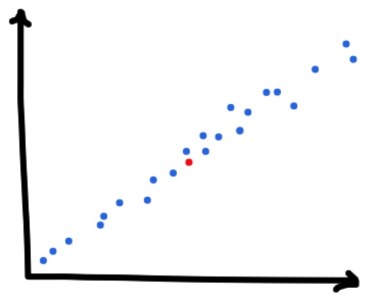
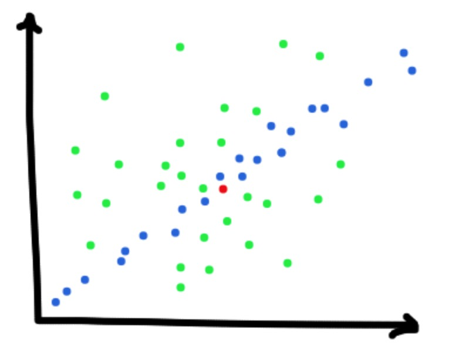
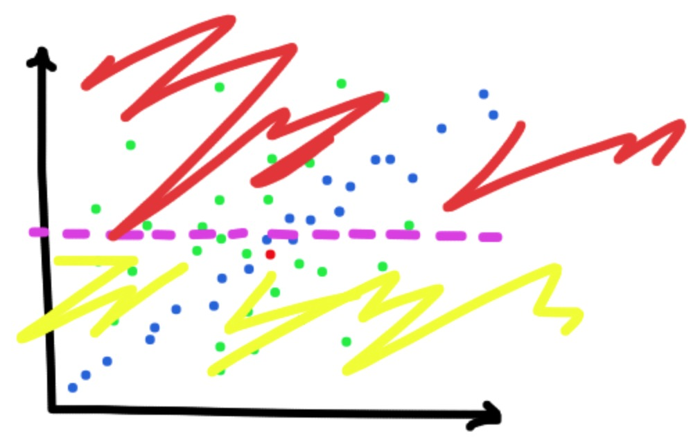

# Fooling LIME and SHAP: Adversarial Attacks on Post hoc Explanation Methods

This is the code for our paper, "Fooling LIME and SHAP: Adversarial Attacks on Post hoc Explanation Methods."

Read the [paper](https://arxiv.org/abs/1911.02508).

## Getting started

Setup virtual environment and install requirements:

```
conda create -n fooling_limeshap python=3.7
source activate fooling_limeshap
pip install -r requirements.txt
```

You should be able to run the code now!

We provide a short walk through on COMPAS in `COMPAS_Example.ipynb`.  This is a nice place to get started to see how our method works.  Applications of the attack on each data set can be found in `compas_experiment.py`, `cc_experiment.py`, and `german_experiment.py`. 

<!-- ## Intuition

How does this method work? Consider some data distributed along a line in the (x,y) plane like such and the instance to explain in red. 

<p align="center">

</p>

Model agnostic post-hoc explanation techniques tend to _perturb around_ the instance.  This could look like the distribution in green below.  Only a few of these instances are in the true distribution of data.

<p align="center">
	
</p>

Because the perturbation distribution is different than the true distribution, we can create a classifier that learns this difference.  Using this classifier, we can classify perturbations differently than the in distribution data. This allows us to introduce _another classifer_ to classify out of distribution data. This looks like:

<p align="center">
	
</p>

Where red and yellow is the out of distribution model. We use a scaffolded classifier to detect if an instance is in distribution or out of distribution. The explanation method (LIME/SHAP) explains the out of distribution model on the out of distribution instances it generates and the true classifier on the in distribution data.  In practice, LIME and SHAP generate _many_ out of distribution instances, so the out of distribution model is explained strongly.  In this example, the x axis would look less important because the out of distribution model doesn't rely on this axis.  

Effectively, this let's us retain (potentially biased or harmful) in distribution decisions while post hoc explanation methods like LIME and SHAP explain other features as the most imporant.  Check out our [paper](https://arxiv.org/abs/1911.02508) for more details! -->

## References

Please consider citing our paper if you found this work useful!

```
@inproceedings{advlime:aies20,
  author = {Dylan Slack and Sophie Hilgard and Emily Jia and Sameer Singh and Himabindu Lakkaraju},
  title = {Fooling LIME and SHAP: Adversarial Attacks on Post hoc Explanation Methods},
  booktitle = {AAAI/ACM Conference on AI, Ethics, and Society (AIES)},
  year = {2020}
}
```

## Contact

This code was developed by Dylan Slack, Sophie Hilgard, and Emily Jia.  Reach out to us with any questions!

Our emails are: [dslack@uci.edu](mailto:dslack@uci.edu), [ash798@g.harvard.edu](mailto:ash798@g.harvard.edu), and [ejia@college.harvard.edu](mailto:ejia@college.harvard.edu).
